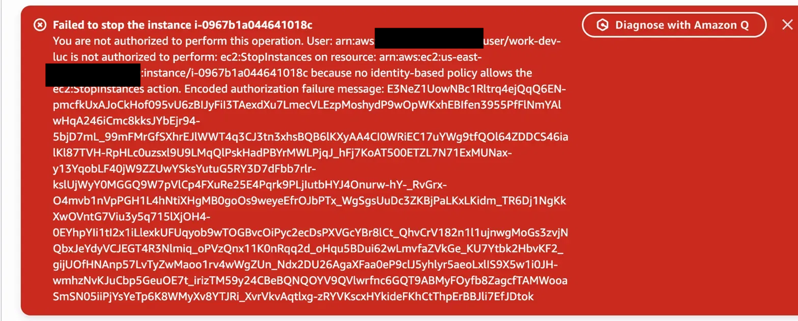
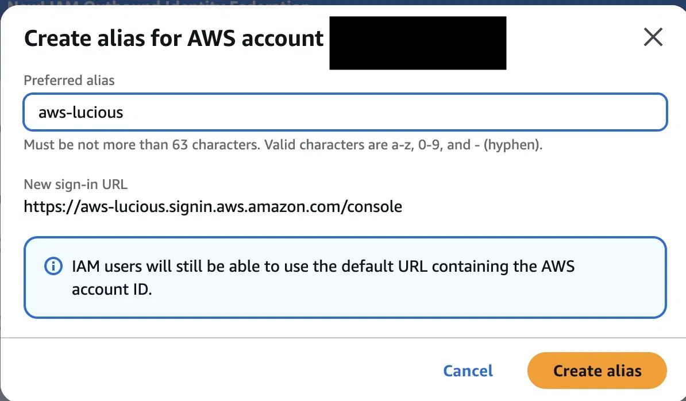

# AWS IAM Security — Tag-Based Access Control

A hands-on cloud security project where I configured AWS IAM to enforce least-privilege access across a simulated production/development environment. The goal was straightforward: a developer should only be able to interact with development resources, and no amount of creativity on their part should let them touch production.


*IAM user work-dev-luc blocked from stopping a production EC2 instance — policy working as intended*

---

## What This Project Covers

- Writing a customer-managed IAM policy with tag-based conditions
- Preventing privilege escalation through explicit Deny statements
- Testing policies with the IAM Policy Simulator before going live
- Understanding the difference between implicit and explicit denial in AWS

**Tools and services:** AWS IAM · EC2 · IAM Policy Simulator

---

## Prerequisites

You'll need an AWS account and a setup IAM user with these permissions:

```
iam:CreateUser
iam:CreateGroup
iam:CreatePolicy
iam:AttachGroupPolicy
iam:CreateAccountAlias
ec2:RunInstances
ec2:CreateTags
```

Don't use your root account for this — create a dedicated admin IAM user instead. Root credentials should only be used for billing and account-level tasks.

This project is console-only. No CLI or SDK setup required.

**Cost:** t3.micro EC2 instances are free-tier eligible in most regions during your first 12 months. Check [aws.amazon.com/free](https://aws.amazon.com/free) for your region. Terminate your instances when you're done.

---

## Architecture

```
AWS Account (aws-lucious)
│
├── IAM User Group: work-dev-group
│   └── Policy: WorkdevEnvironmentPolicy
│       ├── ALLOW  ec2:*           → only on resources tagged Env=development
│       ├── ALLOW  ec2:Describe*   → all resources, no tag condition (by design)
│       └── DENY   ec2:DeleteTags, ec2:CreateTags → all resources
│
├── IAM User: work-dev-luc
│
└── EC2 Instances
    ├── nextwork-prod-luc   no Env tag      → blocked
    └── next-dev-luc        Env=development → accessible
```

---

## How I Built It

### Account alias

First thing I did was create an account alias so the IAM sign-in URL would be readable rather than a string of numbers.

`IAM → Dashboard → Account Alias (right panel) → Edit`

```
https://aws-lucious.signin.aws.amazon.com/console
```

One thing worth knowing: account aliases are globally unique across all AWS accounts, the same way domain names are. If your chosen alias is taken you'll get an error and need to pick something else.



---

### IAM user and group

Created a user (`work-dev-luc`) to represent a developer, then created a group (`work-dev-group`) and added the user to it. All permissions go on the group, not the user directly — that way if you need to add another developer later, you just add them to the group.


---

### The policy

This is the interesting part. The policy has three statements, and each one exists for a specific reason.

`IAM → Policies → Create Policy → JSON tab`


```json
{
  "Version": "2012-10-17",
  "Statement": [
    {
      "Effect": "Allow",
      "Action": "ec2:*",
      "Resource": "*",
      "Condition": {
        "StringEquals": {
          "ec2:ResourceTag/Env": "development"
        }
      }
    },
    {
      "Effect": "Allow",
      "Action": "ec2:Describe*",
      "Resource": "*"
    },
    {
      "Effect": "Deny",
      "Action": ["ec2:DeleteTags", "ec2:CreateTags"],
      "Resource": "*"
    }
  ]
}
```

**Statement 1 — Allow ec2:\* with a tag condition**

Allows all EC2 resource actions, but only on instances tagged `Env=development`. Without this condition the developer would have full EC2 access across the account.

**Statement 2 — Allow ec2:Describe\* with no condition**

This one trips people up. You might wonder why Describe isn't just covered by the `ec2:*` in statement one. The reason: AWS Describe actions don't support resource-level tag conditions — they operate at the account level. So when a Describe call comes in, there's no resource tag context to evaluate the condition against, and statement one never matches. You need a separate unconditional Allow for Describe to work at all.

**Statement 3 — Deny ec2:DeleteTags and ec2:CreateTags**

This closes an obvious hole. Without it, a developer could just add the `Env=development` tag to a production instance and immediately bypass statement one. The Deny blocks all tag modification regardless of what any Allow statement says — explicit Deny always wins in AWS.

After saving the policy, attach it to the group:

`IAM → User Groups → work-dev-group → Permissions → Add permissions → Attach policies`


---

### EC2 instances

Launched two t3.micro instances — one to represent production, one to represent development. The only difference between them is a tag.

During the launch wizard under **Name and tags**, I added:
- `next-dev-luc`: Key = `Env`, Value = `development`
- `nextwork-prod-luc`: no Env tag

Tag values are case-sensitive. `Development` and `development` are not the same thing to AWS. The policy uses lowercase `development` so the tag has to match exactly.


---

### Testing

Before logging in as the restricted user, I ran tests in the IAM Policy Simulator to confirm the policy behaved as expected.

`IAM → Access reports → Policy Simulator` or [policysim.aws.amazon.com](https://policysim.aws.amazon.com)

**With the dev tag context set (`ec2:ResourceTag/Env` = `development`):**

StopInstances → allowed


**Without the tag context:**

StopInstances → denied (implicit — no Allow matches without the tag)
DeleteTags → denied (explicit — the Deny statement fires regardless)


The distinction between implicit and explicit denial matters in practice. An implicit deny means no policy matched — you'd fix it by adding a permission. An explicit deny means something actively blocked it — adding a permission won't help, you'd need to remove or narrow the Deny.

**Live test:**

Signed in as `work-dev-luc` and tried to stop `nextwork-prod-luc`. Exactly what I expected:


The restricted user also had no access to Security Hub, Service Catalog, or anything outside the explicitly granted EC2 development scope:


---

## What I Learned

The most interesting part of this project wasn't the access denial itself — it was the tag manipulation gap. At first glance the tag condition seems like enough. But without the Deny on CreateTags, the whole policy can be bypassed in about 30 seconds by anyone who notices the pattern. Closing that gap with an explicit Deny is the kind of thing that separates a policy someone thought through from one someone copied from a tutorial.

The Describe action behavior was also a good reminder that IAM doesn't work uniformly across all actions. Some actions support resource-level permissions, some don't. Knowing which ones fall into which category changes how you write policies.

---

## Cleanup

Run these in order — AWS enforces dependencies and will error if you skip steps.

1. Terminate EC2 instances — `EC2 → Instances → select both → Instance State → Terminate`
2. Detach policy from group — `IAM → User Groups → work-dev-group → Permissions → select policy → Detach`
3. Delete IAM user — `IAM → Users → work-dev-luc → Delete`
4. Delete IAM user group — `IAM → User Groups → work-dev-group → Delete`
5. Delete IAM policy — `IAM → Policies → Customer managed → WorkdevEnvironmentPolicy → Delete`
6. Remove account alias — `IAM → Dashboard → Account Alias → Edit → Delete`

The policy must be detached before it can be deleted. The user must be removed before the group can be deleted. If you hit a dependency error, check you haven't skipped a step.

---

## Troubleshooting

**Simulator shows denied but you expect allowed**
You're probably missing the context key. Add `ec2:ResourceTag/Env` = `development` under Simulation Settings → Context Keys. Without it the simulator has no tag to evaluate the condition against.

**Live console denies access on the dev instance**
Check the actual tag on the instance: `EC2 → Instances → next-dev-luc → Tags tab`. Confirm the key is `Env` (capital E) and value is `development` (lowercase). One character off and the condition fails.

**"This alias is already in use"**
Account aliases are globally unique. Pick something more specific — add your name, a number, or a date: `aws-lucious-2026`.

**"Not authorized to create an account alias"**
Add `iam:CreateAccountAlias` to your setup user, create the alias, then remove it.

**Simulator returns everything as denied with no explanation**
Either the policy isn't attached to the group or the user isn't in the group. Check both: `IAM → User Groups → work-dev-group → Permissions tab` and `Users tab`.

**Cleanup step fails with dependency error**
Follow the order above exactly. Most common mistake: trying to delete the group before removing the user, or deleting the policy before detaching it.

---

**GitHub:** [github.com/lou7776](https://github.com/lou7776)
**LinkedIn:** [linkedin.com/in/lucious-lokko](https://www.linkedin.com/in/lucious-lokko/)
**Project:** [NextWork AWS Security IAM](https://nextwork.ai/projects/aws-security-iam)
